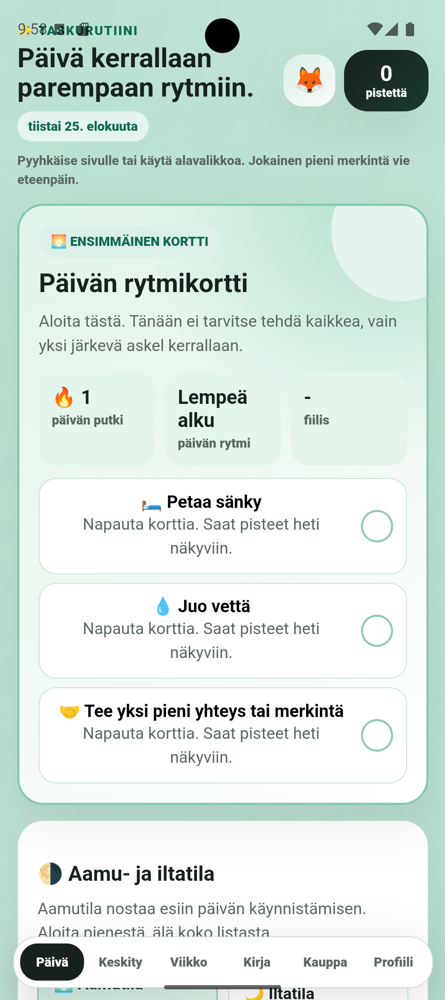
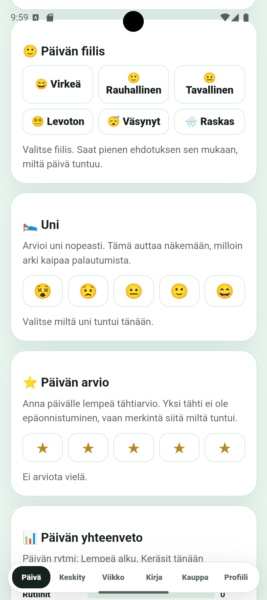
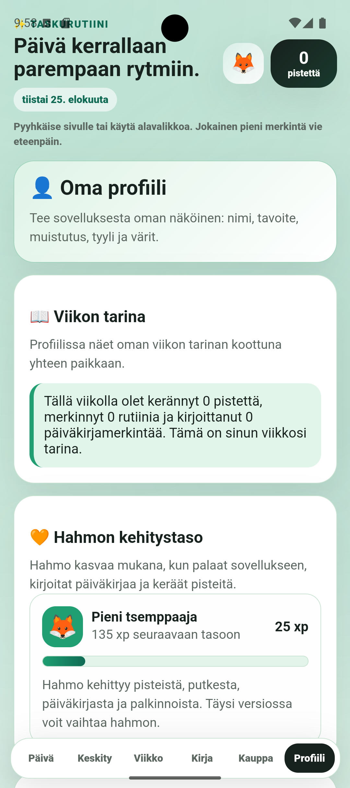

# 📱 TaskuRutiini

<p align="center">
  <strong>Moderni päivittäisten rutiinien ja tehtävien hallintasovellus</strong>
</p>

<p align="center">
  Tehtävät • Rutiinit • Pisteet • Streakit • Teemat • Gamification
</p>

<p align="center">


</p>

---

## 🚀 Projektista

**TaskuRutiini** on moderni päivittäisten rutiinien ja tehtävien hallintaan suunniteltu sovellus.

Tavoitteena on tehdä tavallisesta tehtävälistasta motivoivampi yhdistämällä siihen **pelillisiä elementtejä, pisteitä, streakit, saavutuksia ja muokattavia teemoja**.

Sovellusta kehitetään jatkuvasti ja projektin tarkoituksena on toimia käytännön ohjelmistokehitysprojektina, jossa yhdistyvät käyttöliittymäsuunnittelu, JavaScript-kehitys, Android-julkaisu ja tekoälyn hyödyntäminen ohjelmistokehityksessä.

---

## ✨ Ominaisuudet

### 📋 Päivittäiset tehtävät
- Luo ja hallitse päivittäisiä tehtäviä
- Merkitse tehtävät tehdyiksi ja seuraa päivän etenemistä
- Rakenna kestäviä päivittäisiä rutiineja

### ⭐ Pistejärjestelmä & Gamification
- **XP & Pisteet:** Ansaitse pisteitä suoritetuista tehtävistä ja käytä niitä palkintokaupassa
- **🔥 Streakit:** Ylläpidä rutiineja seuraamalla peräkkäisiä onnistuneita päiviä
- **🏆 Saavutukset & Palkinnot:** Seuraa omaa edistymistäsi motivoivan palkitsemisjärjestelmän avulla

### 🎨 Teemat
Käyttäjä voi muokata sovelluksen ulkoasua mieltymystensä mukaan:
- 🌙 **Yötila**
- 🎨 **Graffiti**
- 💜 **Neon**
- ☀️ **Vaalea teema**

Teemajärjestelmä on suunniteltu varmistamaan, että käyttöliittymän värit, tekstit ja komponentit säilyvät selkeinä ja luettavina teemasta riippumatta.

---

## 📱 Android-versio

TaskuRutiinista on rakennettu erillinen Android-versio, joka hyödyntää WebView-pohjaista toteutusta. Tämän ansiosta sama sovelluskokemus voidaan paketoida kevyeksi Android APK -sovellukseksi.

Projektissa hyödynnetään myös **GitHub Actions** -automaatiota Android-buildien ja APK-tiedostojen kääntämiseen.

---

## 🧰 Teknologia & Työkalut

- **Käyttöliittymä & Logiikka:** HTML5, CSS3, JavaScript (ES6+)
- **Mobiilialusta:** Android (WebView Wrapper)
- **CI/CD:** GitHub Actions (Automatisoidut APK-buildit)
- **Kehitys:** AI-assisted development (arkkitehtuuri, buginetsintä ja sparraus)

---

## 🛠️ Asennus ja käyttö

### Koodin ajaminen lokaalisti
1. Kloonaa repositorio omalle koneellesi:
   ```bash
   git clone [https://github.com/Pekx97/taskurutiini-android.git](https://github.com/Pekx97/taskurutiini-android.git)
   ## 🖼️ Kuvakaappaukset

| Päänäkymä |              Teemat              | Profiili |
| :---: |:--------------------------------:| :---: |
|  |  |  |